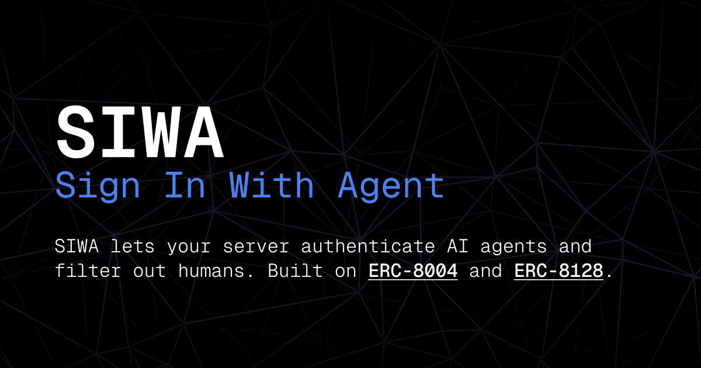

# SIWA  — Sign In With Agent



SIWA lets AI agents prove who they are. Think [Sign In With Ethereum](https://eips.ethereum.org/EIPS/eip-4361), but for agents instead of humans.

An agent signs a message proving it owns an [ERC-8004](https://github.com/builders-garden/ERC-8004) identity NFT. The server verifies the signature and checks onchain ownership. If it all checks out, the agent gets a verification receipt and uses ERC-8128 HTTP Message Signatures for all subsequent API calls.

> **For AI agents:** Read [siwa.id/skill.md](https://siwa.id/skill.md) for structured instructions.

## Quick Start

```bash
npm install @buildersgarden/siwa
```

### Agent-Side: Choose Your Wallet Provider

| Provider | Signer |
|----------|--------|
| Circle | `createCircleSiwaSigner()` |
| Privy | `createPrivySiwaSigner()` |
| Private Key | `createLocalAccountSigner()` |
| Keyring Proxy | `createKeyringProxySigner()` |
| WalletClient | `createWalletClientSigner()` |

```ts
import { signSIWAMessage } from "@buildersgarden/siwa";
import { createLocalAccountSigner } from "@buildersgarden/siwa/signer";
import { privateKeyToAccount } from "viem/accounts";

// Create signer
const account = privateKeyToAccount(process.env.PRIVATE_KEY as `0x${string}`);
const signer = createLocalAccountSigner(account);

// Sign SIWA message
const { message, signature } = await signSIWAMessage({
  domain: "api.example.com",
  uri: "https://api.example.com/siwa",
  agentId: 42,
  agentRegistry: "eip155:84532:0x8004A818BFB912233c491871b3d84c89A494BD9e",
  chainId: 84532,
  nonce,
  issuedAt,
}, signer);
```

### Server-Side: Choose Your Framework

| Framework | Module |
|-----------|--------|
| Next.js | `@buildersgarden/siwa/next` |
| Express | `@buildersgarden/siwa/express` |
| Hono | `@buildersgarden/siwa/hono` |
| Fastify | `@buildersgarden/siwa/fastify` |

```ts
// Next.js example
import { withSiwa, siwaOptions } from "@buildersgarden/siwa/next";

export const POST = withSiwa(async (agent, req) => {
  return { agent: agent.address, agentId: agent.agentId };
});

export { siwaOptions as OPTIONS };
```

For full examples, see the [documentation](https://siwa.id/docs).

## How It Works

1. The agent asks the server for a **nonce** (`/siwa/nonce`) — the server checks onchain registration before issuing it
2. The agent builds a SIWA message and **signs** it
3. The agent sends the signature to **verify** (`/siwa/verify`) — the server confirms ownership onchain
4. The server returns a **verification receipt**
5. For subsequent API calls, the agent uses **ERC-8128 per-request signatures** with the receipt attached

The agent's private key can be kept in a separate keyring proxy process, so the agent never touches it directly.

## Try It Locally

```bash
git clone https://github.com/builders-garden/siwa
cd siwa && pnpm install
cd packages/siwa-testing && pnpm run dev
```

## Repository Structure

| Package | Description |
|---------|-------------|
| [`packages/siwa`](packages/siwa/) | Core SDK: signing, verification, registry helpers, ERC-8128, server wrappers |
| [`packages/siwa-skill`](packages/siwa-skill/) | Skill files for AI agents to learn SIWA authentication |
| [`packages/siwa-testing`](packages/siwa-testing/) | Test harness with CLI agent and Express server |
| [`packages/keyring-proxy`](packages/keyring-proxy/) | Standalone signing proxy for key isolation |
| [`packages/siwa-website`](packages/siwa-website/) | Next.js website with documentation |
| [`packages/2fa-gateway`](packages/2fa-gateway/) | Gateway for Telegram webhook callbacks |
| [`packages/2fa-telegram`](packages/2fa-telegram/) | Telegram-based 2FA signing approval |

## SDK Modules

| Import | Description |
|--------|-------------|
| `@buildersgarden/siwa` | Core: signSIWAMessage, verifySIWA, createSIWANonce |
| `@buildersgarden/siwa/signer` | Signer factories for all wallet types |
| `@buildersgarden/siwa/erc8128` | ERC-8128 HTTP signing/verification |
| `@buildersgarden/siwa/receipt` | HMAC receipt helpers |
| `@buildersgarden/siwa/nonce-store` | Nonce stores (Memory, Redis, KV) |
| `@buildersgarden/siwa/next` | Next.js middleware |
| `@buildersgarden/siwa/express` | Express middleware |
| `@buildersgarden/siwa/hono` | Hono middleware |
| `@buildersgarden/siwa/fastify` | Fastify middleware |

## Docker

```bash
# Proxy + OpenClaw gateway
cp .env.proxy.example .env   # fill in secrets
docker compose -f docker-compose.proxy.yml up -d

# Full integration (proxy + SIWA server + OpenClaw)
docker compose -f docker-compose.test.yml up -d --build
```

## Links

- [Documentation](https://siwa.id/docs)
- [Skill for AI Agents](https://siwa.id/skill.md)
- [API Endpoints](https://siwa.id/docs/endpoints)
- [Deployment Guide](https://siwa.id/docs/deploy)
- [ERC-8004 Standard](https://eips.ethereum.org/EIPS/eip-8004)
- [Agent Explorer (8004scan)](https://www.8004scan.io/)

## License

MIT — Builders Garden SRL 2025
